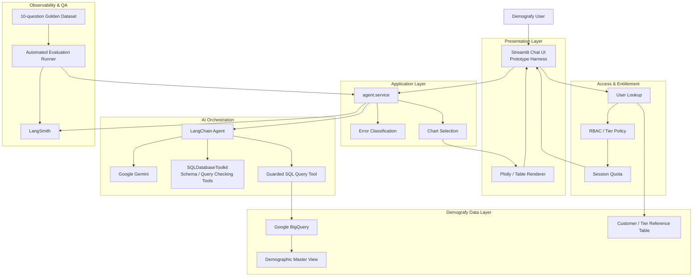
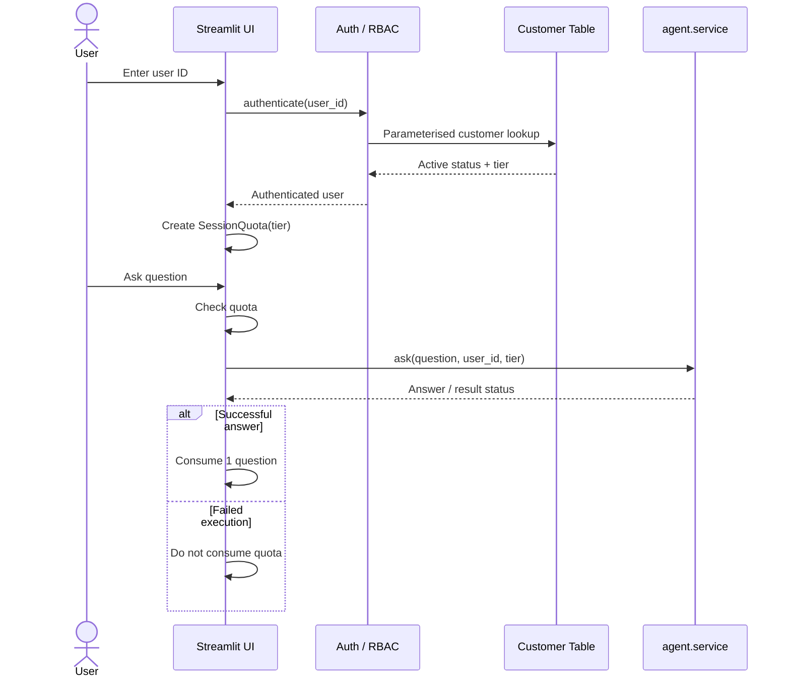
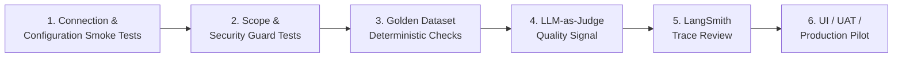
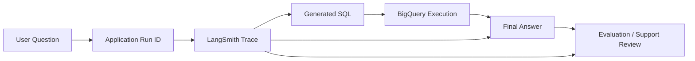
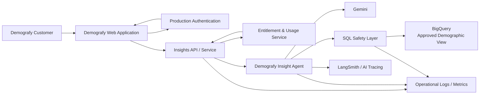

<div align="center">

# Demografy Insights Chat Agent

### Natural-language demographic insights powered by Gemini, LangChain and BigQuery

<p>
  Ask a demographic question in plain English, translate it into controlled SQL,
  query the approved Demografy data source, and return a traceable text answer with an optional chart or table.
</p>


</div>

---

## Executive summary

The **Demografy Insights Chat Agent** is a proposed conversational feature for Demografy's demographic data.

Instead of requiring users to understand database schemas, KPI column names or SQL, the feature allows a user to ask questions such as:

> **What is the prosperity score for Glenwood?**

or:

> **Show the top 3 most diverse suburbs in Victoria.**

The agent interprets the request, identifies the correct KPI and geography, generates SQL, executes it against the approved BigQuery demographic view, and returns a plain-English response. Where useful, the application can also render a chart or table.

The repository demonstrates the proposed feature end to end and includes RBAC, tier quotas, SQL safety controls, error handling, LangSmith tracing, automated evaluation assets and a Streamlit test harness.

The recommended next phase is **productionisation**, rather than expansion of the feature scope.

---

## Contents

<table>
<tr>
<td width="33%">

**Product & business**
- [Current state](#current-state)
- [Business problem](#business-problem)
- [Business requirements](#business-requirements)

</td>
<td width="33%">

**Solution**
- [Solution architecture](#solution-architecture)
- [RBAC](#rbac-and-customer-entitlements)
- [Data and SQL safety](#data-and-sql-safety)
- [Project structure](#project-structure)

</td>
<td width="33%">

**Assurance & production**
- [Testing approach](#testing-approach)
- [Monitoring and traceability](#monitoring-and-traceability)
- [Production recommendation](#recommendation-for-demografy-production-intake)
- [Suggested next steps](#suggested-next-steps)

</td>
</tr>
</table>

---

# Current state

The current **Demografy.com.au** experience does **not** include a conversational AI feature that allows users to ask demographic questions in natural language.

Today, demographic insight discovery is based on the existing Demografy product experience. The proposed **Insights Chat Agent** introduces a new interaction model where a user can ask a question in plain English and receive a demographic answer derived from approved Demografy data.

### Current-state gap

<table>
<thead>
<tr>
<th>Area</th>
<th>Current Demografy.com.au state</th>
<th>Proposed Insights Chat capability</th>
</tr>
</thead>
<tbody>
<tr>
<td><strong>User interaction</strong></td>
<td>Users navigate the existing Demografy experience to find demographic information.</td>
<td>Users can ask a demographic question in natural language.</td>
</tr>
<tr>
<td><strong>KPI discovery</strong></td>
<td>Users need to identify the relevant demographic measure through the existing interface.</td>
<td>The agent interprets business terminology and maps it to the relevant KPI.</td>
</tr>
<tr>
<td><strong>Geography selection</strong></td>
<td>Users work through the current product's geography selection and data views.</td>
<td>The requested suburb, SA2, state or supported geography can be interpreted from the question.</td>
</tr>
<tr>
<td><strong>Insight generation</strong></td>
<td>No conversational question-to-answer workflow is currently available.</td>
<td>The feature converts a user question into a controlled data query and returns a readable answer.</td>
</tr>
<tr>
<td><strong>Conversational follow-up</strong></td>
<td>No AI chat experience is currently available.</td>
<td>The proposed feature creates a chat-based path for demographic exploration.</td>
</tr>
<tr>
<td><strong>AI traceability</strong></td>
<td>Not applicable because the chat feature is not currently part of the website.</td>
<td>Agent runs can be traced for quality review, troubleshooting and support.</td>
</tr>
</tbody>
</table>

The repository in this project is therefore best understood as a **proposed new Demografy feature** that demonstrates how conversational demographic insight could be added to the existing platform.

---

# Business problem

Demografy provides valuable demographic data, but the current website does not offer a conversational way for users to ask questions and receive direct answers from that data.

The proposed Insights Chat Agent addresses this gap by allowing users to ask demographic questions in plain English, with the system identifying the relevant KPI and geography, querying approved Demografy data, and returning a clear answer.

The intended business outcome is a simpler and faster path from **user question to demographic insight**, while retaining appropriate controls around data access, customer entitlements, quality and traceability.

---

# Business requirements

<table>
<thead>
<tr>
<th>#</th>
<th>Requirement</th>
<th>What it means</th>
<th>Current state</th>
</tr>
</thead>
<tbody>
<tr>
<td>1</td>
<td><strong>Natural-language querying</strong></td>
<td>Users can ask supported demographic questions using normal business language.</td>
<td>✅ Implemented</td>
</tr>
<tr>
<td>2</td>
<td><strong>KPI understanding</strong></td>
<td>The solution maps business KPI names and aliases to the correct Demografy data fields.</td>
<td>✅ Implemented</td>
</tr>
<tr>
<td>3</td>
<td><strong>Geography understanding</strong></td>
<td>The agent identifies and applies the requested geography to the query.</td>
<td>✅ Implemented</td>
</tr>
<tr>
<td>4</td>
<td><strong>SQL generation</strong></td>
<td>The AI converts a supported user question into BigQuery SQL.</td>
<td>✅ Implemented</td>
</tr>
<tr>
<td>5</td>
<td><strong>Controlled data access</strong></td>
<td>The AI may query only the approved demographic data source.</td>
<td>✅ Implemented</td>
</tr>
<tr>
<td>6</td>
<td><strong>Customer entitlement</strong></td>
<td>The customer tier is resolved outside the AI agent.</td>
<td>✅ Prototype implemented</td>
</tr>
<tr>
<td>7</td>
<td><strong>Tier quotas</strong></td>
<td>Free, Basic and Pro users receive different session question limits.</td>
<td>✅ Prototype implemented</td>
</tr>
<tr>
<td>8</td>
<td><strong>Natural-language answers</strong></td>
<td>Query results are presented as understandable text rather than raw SQL output.</td>
<td>✅ Implemented</td>
</tr>
<tr>
<td>9</td>
<td><strong>Simple visualisation</strong></td>
<td>Where useful, the result may be shown as an approved chart or table.</td>
<td>✅ Implemented</td>
</tr>
<tr>
<td>10</td>
<td><strong>Safe failure handling</strong></td>
<td>Model, data and agent failures must not crash the user experience.</td>
<td>✅ Implemented</td>
</tr>
<tr>
<td>11</td>
<td><strong>Traceability</strong></td>
<td>AI requests should be traceable for debugging, support and evaluation.</td>
<td>✅ Implemented</td>
</tr>
<tr>
<td>12</td>
<td><strong>Quality evaluation</strong></td>
<td>Agent responses should be tested against known-correct expected outcomes.</td>
<td>✅ Framework implemented</td>
</tr>
<tr>
<td>13</td>
<td><strong>Scope control</strong></td>
<td>Unsupported, destructive, individual-level, non-demographic, predictive or inappropriate requests should be rejected or constrained.</td>
<td>✅ Prompt and code controls implemented</td>
</tr>
</tbody>
</table>

### Intended scope boundaries

The agent should not:

- modify Demografy data
- run destructive SQL
- query arbitrary BigQuery tables
- expose customer account records through the AI agent
- provide individual-level demographic information
- answer unrelated questions as if they were demographic insights
- invent undocumented KPI definitions
- make unsupported predictions or causal claims from snapshot data
- turn subjective value judgements into factual demographic conclusions

---

# Solution architecture

<div align="center">

**Current logical architecture**

</div>



## Architecture design principles

<table>
<tr>
<td width="25%"><strong>Separation of concerns</strong></td>
<td>The Streamlit UI calls the application service. It does not need to understand LangChain internals.</td>
</tr>
<tr>
<td><strong>Customer data separation</strong></td>
<td>User entitlement is resolved outside the AI agent. Customer records are not intended to be exposed as an AI-queryable source.</td>
</tr>
<tr>
<td><strong>Guarded SQL execution</strong></td>
<td>The standard SQL query execution tool is replaced by a guarded tool that routes AI-generated SQL through the application's BigQuery safety controls.</td>
</tr>
<tr>
<td><strong>Text-first experience</strong></td>
<td>The primary answer is text. A chart or table is supplementary where the data shape benefits from visualisation.</td>
</tr>
<tr>
<td><strong>Traceable execution</strong></td>
<td>Agent requests can carry metadata and LangSmith traces to support debugging and evaluation.</td>
</tr>
</table>

---

# RBAC and customer entitlements

The prototype supports three customer tiers.

<table>
<thead>
<tr>
<th>Tier</th>
<th>Questions per session</th>
<th>Warning threshold</th>
</tr>
</thead>
<tbody>
<tr>
<td><strong>Free</strong></td>
<td>5</td>
<td>Not required</td>
</tr>
<tr>
<td><strong>Basic</strong></td>
<td>20</td>
<td>15</td>
</tr>
<tr>
<td><strong>Pro</strong></td>
<td>50</td>
<td>45</td>
</tr>
</tbody>
</table>

### Prototype RBAC flow



### Production recommendation for RBAC

For Demografy production, the current user ID sign-in should be replaced by the platform's existing authentication and identity mechanism.

The production application should receive a trusted authenticated customer identity and entitlement from the Demografy platform rather than accepting an arbitrary user ID from the browser.

If usage limits form part of customer billing or subscription entitlement, quota consumption should be persisted server-side rather than existing only in Streamlit session state.

---

# Data and SQL safety

The solution uses multiple controls rather than relying only on model instructions.

### 1. Restricted schema exposure

The agent's SQL database configuration exposes the approved demographic master view for AI schema introspection.

### 2. Guarded query execution

The standard LangChain `sql_db_query` execution tool is replaced with a guarded implementation before the agent is created.

The guarded path routes model-generated SQL through application controls before execution.

### 3. Read-only SQL controls

The BigQuery layer is designed to reject destructive operations such as:

```text
INSERT
UPDATE
DELETE
DROP
ALTER
CREATE
MERGE
TRUNCATE
```

### 4. Allowed-table enforcement

AI-generated queries are restricted to the demographic master view.

The customer / tier reference table belongs to the authentication path and should not be available to the AI agent.

### 5. Parameterised customer lookup

Customer identifiers should be supplied to BigQuery as parameters rather than interpolated into SQL text.

### 6. Query cost and result controls

Production should retain limits such as:

- maximum result rows
- timeout
- maximum bytes billed
- fully qualified table requirements
- least-privilege BigQuery IAM

> **Design principle:** Prompt instructions are useful behaviour guidance, but security-critical restrictions should also be enforced in code and infrastructure.

---

# Testing approach

The solution uses several layers of testing because a conversational data agent can fail in different ways.

## Test strategy



## 1. Connection and configuration smoke testing

`scripts/check_connections.py` is used to validate the key runtime dependencies before functional testing.

Typical checks include:

- environment configuration
- BigQuery connectivity
- access to the approved data source
- Gemini connectivity
- LangSmith configuration
- agent creation
- RBAC/customer lookup

## 2. Scope and security testing

Scope controls should be tested separately from answer quality.

Examples include:

- destructive SQL is rejected
- unapproved tables cannot be queried
- customer data cannot be exposed through the LLM
- result limits are enforced
- unsupported request types are refused
- prompt injection does not bypass data restrictions

## 3. Golden Dataset

The repository includes a **10-question Golden Dataset** to provide repeatable baseline evaluation.

The dataset is intended to cover representative scenarios such as:

- a single KPI lookup
- population lookup
- KPI comparisons
- geography comparisons
- natural-language KPI aliases
- rankings
- unsupported KPI behaviour

## 4. Deterministic evaluation

Where possible, test results should be validated against objective ground truth.

Checks may include:

- expected KPI/data column
- expected geography
- expected numeric value or tolerance
- expected ranking order
- correct refusal behaviour

Deterministic checks should remain the primary quality gate for data correctness.

## 5. LLM-as-a-Judge

A second model can score the user-facing answer against a known expected answer.

This is useful for qualities that are harder to express as exact assertions, but should remain a **secondary signal**.

> **Current review note:** Before the evaluation runner is used as a formal production quality gate, reconcile the current runner/judge interface and ensure the pass threshold uses the same scoring scale as the judge.

## 6. Trace review

For failed or unexpected evaluations, the LangSmith trace should be reviewed to determine whether the issue originated in:

- question interpretation
- KPI selection
- geography selection
- SQL generation
- SQL execution
- result interpretation
- answer wording

## Production test expansion

Before full production release, Demografy should add:

- unit tests for RBAC and SQL guards
- authentication and authorization tests
- prompt injection tests
- integration tests against a controlled non-production dataset
- frontend regression tests
- malformed and ambiguous question tests
- empty-result tests
- model outage simulation
- BigQuery outage simulation
- rate-limit handling tests
- concurrency and performance tests
- privacy and logging tests
- regression evaluation for every prompt or model change

The 10-question Golden Dataset is a useful baseline, not sufficient evidence of general production accuracy on its own.

---

# Monitoring and traceability

LangSmith provides AI-agent traceability during development and evaluation.

A request can be associated with operational context such as:

- user identifier
- customer tier
- generated SQL
- execution latency
- tool activity
- model interactions
- result status
- trace identifier
- trace URL

### Traceability model



## Production monitoring recommendations

LangSmith should be part of the observability solution, but not the only operational monitoring mechanism.

Demografy should monitor:

<table>
<thead>
<tr>
<th>Area</th>
<th>Recommended metrics</th>
</tr>
</thead>
<tbody>
<tr>
<td><strong>Availability</strong></td>
<td>Request count, successful request rate, failure rate, dependency failures</td>
</tr>
<tr>
<td><strong>Performance</strong></td>
<td>Average latency, p50, p95, p99, BigQuery execution time, model response time</td>
</tr>
<tr>
<td><strong>AI quality</strong></td>
<td>Evaluation pass rate, unsupported-question rate, refusal rate, trace review findings</td>
</tr>
<tr>
<td><strong>Data safety</strong></td>
<td>Rejected SQL, disallowed table attempts, prompt-injection detections</td>
</tr>
<tr>
<td><strong>Cost</strong></td>
<td>Gemini usage, BigQuery bytes processed, cost per successful question</td>
</tr>
<tr>
<td><strong>Customer usage</strong></td>
<td>Questions per tier, quota exhaustion, feature adoption, common request types</td>
</tr>
<tr>
<td><strong>Change traceability</strong></td>
<td>Application version, prompt version, model version, evaluation baseline version</td>
</tr>
</tbody>
</table>

Production logs and trace retention should also be reviewed against Demografy's privacy and data-retention requirements.

---

# Recommendation for Demografy production intake

The current implementation should be treated as a strong **production candidate**, but not deployed to customers unchanged.

A controlled intake path is recommended.

## Production intake gates

<table>
<thead>
<tr>
<th>Gate</th>
<th>Required outcome</th>
</tr>
</thead>
<tbody>
<tr>
<td><strong>1. Functional readiness</strong></td>
<td>Core question, SQL, data, answer, chart and quota flows operate reliably in an integrated test environment.</td>
</tr>
<tr>
<td><strong>2. Security readiness</strong></td>
<td>Least-privilege BigQuery access, guarded SQL execution, identity integration, secret management and customer-data separation are independently verified.</td>
</tr>
<tr>
<td><strong>3. Quality readiness</strong></td>
<td>The automated evaluator is corrected/validated, the Golden Dataset is expanded and measurable acceptance thresholds are agreed.</td>
</tr>
<tr>
<td><strong>4. Platform integration</strong></td>
<td>The agent is placed behind a controlled Demografy service/API boundary and integrated with production authentication and entitlement.</td>
</tr>
<tr>
<td><strong>5. Operational readiness</strong></td>
<td>Monitoring, alerting, CI/CD, environment separation, rollback, support ownership and incident procedures are established.</td>
</tr>
<tr>
<td><strong>6. Controlled pilot</strong></td>
<td>A limited pilot validates answer quality, usefulness, latency, stability, cost and support demand before wider rollout.</td>
</tr>
</tbody>
</table>

## Recommended production architecture



### Recommended role of Streamlit

The current Streamlit application is valuable as:

- a developer harness
- a QA environment
- a demonstration interface
- an internal support/debugging tool

For production customer access, Demografy's existing frontend should preferably call the insight capability through a controlled backend/API service.

This separates the customer UI from:

- AI orchestration
- database permissions
- secrets
- usage enforcement
- monitoring
- model configuration
- release management

---

# Suggested next steps

<table>
<thead>
<tr>
<th>Priority</th>
<th>Activity</th>
<th>Outcome</th>
</tr>
</thead>
<tbody>
<tr>
<td><strong>P0</strong></td>
<td>Validate and correct the automated evaluation runner/judge interface and scoring threshold.</td>
<td>Reliable regression results can be used as a release gate.</td>
</tr>
<tr>
<td><strong>P0</strong></td>
<td>Run and evidence all SQL guard, table allow-list and scope tests.</td>
<td>Security-critical controls are proven before customer access.</td>
</tr>
<tr>
<td><strong>P0</strong></td>
<td>Complete an end-to-end regression run using the current main branch.</td>
<td>A clean technical baseline is established.</td>
</tr>
<tr>
<td><strong>P1</strong></td>
<td>Integrate with Demografy's production authentication and entitlement model.</td>
<td>Trusted customer identity replaces prototype user-ID sign-in.</td>
</tr>
<tr>
<td><strong>P1</strong></td>
<td>Persist usage/quota state if question limits are commercially significant.</td>
<td>Usage limits remain reliable across browsers, sessions and deployments.</td>
</tr>
<tr>
<td><strong>P1</strong></td>
<td>Expand the Golden Dataset with ambiguous, negative, adversarial and edge cases.</td>
<td>Regression coverage better reflects real customer behaviour.</td>
</tr>
<tr>
<td><strong>P1</strong></td>
<td>Add CI checks for unit tests, scope checks and evaluation thresholds.</td>
<td>Unsafe or lower-quality changes are blocked before merge or deployment.</td>
</tr>
<tr>
<td><strong>P1</strong></td>
<td>Move production secrets to an approved secret-management service.</td>
<td>Credentials are managed outside developer configuration files.</td>
</tr>
<tr>
<td><strong>P2</strong></td>
<td>Create Development, Test/UAT and Production environments.</td>
<td>Changes can be tested and promoted through a controlled release lifecycle.</td>
</tr>
<tr>
<td><strong>P2</strong></td>
<td>Implement application metrics, dashboards and alerts alongside LangSmith.</td>
<td>Operations teams can monitor availability, latency, cost and failures.</td>
</tr>
<tr>
<td><strong>P2</strong></td>
<td>Version prompts, model configuration and evaluation baselines.</td>
<td>Every production answer can be associated with the behaviour configuration that produced it.</td>
</tr>
<tr>
<td><strong>P2</strong></td>
<td>Complete privacy, retention and support-readiness review.</td>
<td>Operational ownership and data handling are clear before launch.</td>
</tr>
<tr>
<td><strong>P3</strong></td>
<td>Run a controlled production pilot.</td>
<td>Real customer behaviour validates quality, usefulness, performance and cost.</td>
</tr>
<tr>
<td><strong>P3</strong></td>
<td>Use pilot findings to define the general-availability release gate.</td>
<td>Wider rollout is evidence-based.</td>
</tr>
</tbody>
</table>

---

# Project structure

```text
Insights_Chat_Agent_D-grafy/
├── app.py                        # Streamlit entry point
├── config.py                     # Environment-driven configuration and secrets
│
├── agent/
│   ├── service.py                # Application layer; UI entry point to the agent
│   ├── sql_agent.py              # LangChain SQL agent + Gemini integration
│   ├── prompts.py                # System prompt + few-shot examples
│   └── tools.py                  # Result formatting and SQL extraction
│
├── auth/
│   ├── users.py                  # User lookup + ID validation
│   └── rbac.py                   # Tier policy and question quotas
│
├── db/
│   ├── bigquery_client.py        # BigQuery access + read-only query controls
│   └── schema.py                 # Demografy data dictionary and KPI mappings
│
├── eval/
│   ├── golden_dataset.json       # 10-question Golden Dataset
│   ├── judge.py                  # LLM-as-Judge scoring of agent responses
│   └── run_eval.py               # Runs automated evaluation and reports results
│
├── scripts/
│   ├── check_connections.py      # Connection / configuration smoke test
│   └── explore_master_view.py    # Profiles a_master_view
│
└── docs/
    └── data_profile.md           # Generated data profile, gitignored
```

> The tree above is the presentation-level project structure requested for this README. Supporting implementation files may also exist in the repository.

---

# Technology stack

<table>
<thead>
<tr>
<th>Layer</th>
<th>Technology</th>
<th>Role</th>
</tr>
</thead>
<tbody>
<tr>
<td>Prototype frontend</td>
<td>Streamlit</td>
<td>Chat, user session, quota display and developer harness</td>
</tr>
<tr>
<td>AI model</td>
<td>Google Gemini</td>
<td>Natural-language understanding and response generation</td>
</tr>
<tr>
<td>Agent framework</td>
<td>LangChain / LangGraph runtime</td>
<td>Tool orchestration and SQL-agent execution</td>
</tr>
<tr>
<td>Data platform</td>
<td>Google BigQuery</td>
<td>Demographic data queries and customer reference lookup</td>
</tr>
<tr>
<td>Visualisation</td>
<td>Plotly / Streamlit table</td>
<td>Optional chart and table rendering</td>
</tr>
<tr>
<td>AI observability</td>
<td>LangSmith</td>
<td>Agent traceability and debugging</td>
</tr>
<tr>
<td>Evaluation</td>
<td>Golden Dataset + deterministic checks + LLM judge</td>
<td>Regression and answer-quality assessment</td>
</tr>
</tbody>
</table>

---

# Local development

## 1. Create a virtual environment

```bash
python -m venv .venv
```

Activate it using the command appropriate to your operating system.

## 2. Install dependencies

```bash
pip install -r requirements.txt
```

## 3. Create local configuration

```bash
cp .env.example .env
```

Populate the required BigQuery, Gemini and optional LangSmith settings.

## 4. Authenticate to Google Cloud

Use the approved local development authentication method for the environment.

## 5. Run the connection checks

```bash
python -m scripts.check_connections
```

## 6. Start the prototype

```bash
streamlit run app.py
```

## 7. Run the evaluation suite

After validating the evaluator interface and scoring configuration:

```bash
python -m eval.run_eval
```

---

# Example backend usage

```python
from agent.service import ask

result = ask(
    "Top 3 most diverse suburbs in Victoria",
    user_id="user_001",
    tier="pro",
    with_data=True,
)

print(result.answer)
print(result.sql)
print(result.trace_url)
```

The application service is intended to provide the UI with a stable boundary for:

- user-facing answer
- generated SQL for QA/debugging
- chart specification
- result data where required
- execution latency
- trace information
- stable error outcome

---

# Production acceptance checklist

<details>
<summary><strong>Security & identity</strong></summary>

- [ ] Production authentication integrated
- [ ] Tier / entitlement comes from a trusted server-side identity
- [ ] BigQuery service account uses least privilege
- [ ] Customer table is unavailable to the AI query path
- [ ] Guarded SQL execution has automated tests
- [ ] Prompt-injection tests pass
- [ ] Secrets are held in an approved secrets platform
- [ ] Logging and traces meet privacy requirements

</details>

<details>
<summary><strong>Quality</strong></summary>

- [ ] Evaluation runner and judge interface validated
- [ ] Judge scale and release threshold aligned
- [ ] Expanded Golden Dataset approved
- [ ] Deterministic correctness tests pass
- [ ] Unsupported and adversarial tests pass
- [ ] Regression baseline recorded
- [ ] Prompt/model changes trigger evaluation automatically

</details>

<details>
<summary><strong>Operations</strong></summary>

- [ ] Dev, Test/UAT and Production environments exist
- [ ] CI/CD pipeline established
- [ ] Deployment rollback is documented and tested
- [ ] Availability and latency dashboards exist
- [ ] Error-rate and dependency alerts exist
- [ ] Gemini and BigQuery cost monitoring exists
- [ ] Support and incident ownership is assigned
- [ ] Application, prompt and model versions are traceable

</details>

<details>
<summary><strong>Customer release</strong></summary>

- [ ] Controlled pilot group identified
- [ ] Pilot success measures agreed
- [ ] Customer feedback captured
- [ ] Common unsupported questions analysed
- [ ] Cost per successful question understood
- [ ] General-availability release criteria approved

</details>

---

# Summary

The Demografy Insights Chat Agent demonstrates a practical conversational interface over Demografy's structured demographic data.

The solution already contains the principal building blocks:

- natural-language demographic querying
- KPI and geography-aware SQL generation
- guarded BigQuery execution
- customer tier and quota controls
- text answers with optional charts and tables
- stable error handling
- LangSmith tracing
- Golden Dataset evaluation assets

The recommended focus is now **production hardening and platform integration**.

The most important next steps are to validate the automated evaluation path, complete production identity and entitlement integration, expand the regression suite, establish operational monitoring and deploy through a controlled pilot before broader customer release.

<div align="center">

### Demografy Insights Chat Agent

**From demographic question to controlled, traceable insight.**

</div>
