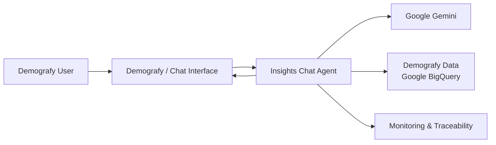

<div align="center">

# Demografy Insights Chat Agent

### Natural-language demographic insights powered by Gemini, LangChain and BigQuery

<p>
  Ask a demographic question in plain English, translate it into controlled SQL,
  query the approved Demografy data source, and return a traceable text answer with an optional chart or table.
</p>


</div>

---

## Executive summary

The **Demografy Insights Chat Agent** is a proposed conversational feature for Demografy's demographic data.

Instead of requiring users to understand database schemas, KPI column names or SQL, the feature allows a user to ask questions such as:

> **What is the prosperity score for Glenwood?**

or:

> **Show the top 3 most diverse suburbs in Victoria.**

The agent interprets the request, identifies the correct KPI and geography, generates SQL, executes it against the approved BigQuery demographic view, and returns a plain-English response. Where useful, the application can also render a chart or table.

The repository demonstrates the proposed feature end to end and includes RBAC, tier quotas, SQL safety controls, error handling, LangSmith tracing, automated evaluation assets and a Streamlit test harness.

The recommended next phase is **productionisation**, rather than expansion of the feature scope.

---

## Contents

<table>
<tr>
<td width="33%">

**Product & business**
- [Current state](#current-state)
- [Business problem](#business-problem)
- [Business requirements](#business-requirements)

</td>
<td width="33%">

**Solution**
- [Solution architecture](#solution-architecture)
- [RBAC](#rbac-and-customer-entitlements)
- [Data and SQL safety](#data-and-sql-safety)
- [Project structure](#project-structure)

</td>
<td width="33%">

**Assurance & production**
- [Testing approach](#testing-approach)
- [Monitoring and traceability](#monitoring-and-traceability)
- [Production recommendation](#recommendation-for-demografy-production-intake)
- [Suggested next steps](#suggested-next-steps)

</td>
</tr>
</table>

---

# Current state

The current **Demografy.com.au** experience does **not** include a conversational AI feature that allows users to ask demographic questions in natural language.

Today, demographic insight discovery is based on the existing Demografy product experience. The proposed **Insights Chat Agent** introduces a new interaction model where a user can ask a question in plain English and receive a demographic answer derived from approved Demografy data.

### Current-state gap

<table>
<thead>
<tr>
<th>Area</th>
<th>Current Demografy.com.au state</th>
<th>Proposed Insights Chat capability</th>
</tr>
</thead>
<tbody>
<tr>
<td><strong>User interaction</strong></td>
<td>Users navigate the existing Demografy experience to find demographic information.</td>
<td>Users can ask a demographic question in natural language.</td>
</tr>
<tr>
<td><strong>KPI discovery</strong></td>
<td>Users need to identify the relevant demographic measure through the existing interface.</td>
<td>The agent interprets business terminology and maps it to the relevant KPI.</td>
</tr>
<tr>
<td><strong>Geography selection</strong></td>
<td>Users work through the current product's geography selection and data views.</td>
<td>The requested suburb, SA2, state or supported geography can be interpreted from the question.</td>
</tr>
<tr>
<td><strong>Insight generation</strong></td>
<td>No conversational question-to-answer workflow is currently available.</td>
<td>The feature converts a user question into a controlled data query and returns a readable answer.</td>
</tr>
<tr>
<td><strong>Conversational follow-up</strong></td>
<td>No AI chat experience is currently available.</td>
<td>The proposed feature creates a chat-based path for demographic exploration.</td>
</tr>
<tr>
<td><strong>AI traceability</strong></td>
<td>Not applicable because the chat feature is not currently part of the website.</td>
<td>Agent runs can be traced for quality review, troubleshooting and support.</td>
</tr>
</tbody>
</table>

The repository in this project is therefore best understood as a **proposed new Demografy feature** that demonstrates how conversational demographic insight could be added to the existing platform.

---

# Business problem

Demografy provides valuable demographic data, but the current website does not offer a conversational way for users to ask questions and receive direct answers from that data.

The proposed Insights Chat Agent addresses this gap by allowing users to ask demographic questions in plain English, with the system identifying the relevant KPI and geography, querying approved Demografy data, and returning a clear answer.

The intended business outcome is a simpler and faster path from **user question to demographic insight**, while retaining appropriate controls around data access, customer entitlements, quality and traceability.

---

# Business requirements

<table>
<thead>
<tr>
<th>#</th>
<th>Requirement</th>
<th>What it means</th>
</tr>
</thead>
<tbody>
<tr>
<td>1</td>
<td><strong>Natural-language querying</strong></td>
<td>Users can ask supported demographic questions using normal business language.</td>
</tr>
<tr>
<td>2</td>
<td><strong>KPI understanding</strong></td>
<td>The solution maps business KPI names and aliases to the correct Demografy data fields.</td>
</tr>
<tr>
<td>3</td>
<td><strong>Geography understanding</strong></td>
<td>The agent identifies and applies the requested geography to the query.</td>
</tr>
<tr>
<td>4</td>
<td><strong>SQL generation</strong></td>
<td>The AI converts a supported user question into BigQuery SQL.</td>
</tr>
<tr>
<td>5</td>
<td><strong>Controlled data access</strong></td>
<td>The AI may query only the approved demographic data source.</td>
</tr>
<tr>
<td>6</td>
<td><strong>Customer entitlement</strong></td>
<td>The customer tier is resolved outside the AI agent.</td>
</tr>
<tr>
<td>7</td>
<td><strong>Tier quotas</strong></td>
<td>Free, Basic and Pro users receive different session question limits.</td>
</tr>
<tr>
<td>8</td>
<td><strong>Natural-language answers</strong></td>
<td>Query results are presented as understandable text rather than raw SQL output.</td>
</tr>
<tr>
<td>9</td>
<td><strong>Simple visualisation</strong></td>
<td>Where useful, the result may be shown as an approved chart or table.</td>
</tr>
<tr>
<td>10</td>
<td><strong>Safe failure handling</strong></td>
<td>Model, data and agent failures must not crash the user experience.</td>
</tr>
<tr>
<td>11</td>
<td><strong>Traceability</strong></td>
<td>AI requests should be traceable for debugging, support and evaluation.</td>
</tr>
<tr>
<td>12</td>
<td><strong>Quality evaluation</strong></td>
<td>Agent responses should be tested against known-correct expected outcomes.</td>
</tr>
<tr>
<td>13</td>
<td><strong>Scope control</strong></td>
<td>Unsupported, destructive, individual-level, non-demographic, predictive or inappropriate requests should be rejected or constrained.</td>
</tr>
</tbody>
</table>

### Intended scope boundaries

The agent should not:

- modify Demografy data
- run destructive SQL
- query arbitrary BigQuery tables
- expose customer account records through the AI agent
- provide individual-level demographic information
- answer unrelated questions as if they were demographic insights
- invent undocumented KPI definitions
- make unsupported predictions or causal claims from snapshot data
- turn subjective value judgements into factual demographic conclusions

---

# Solution architecture

The proposed feature adds a conversational layer over Demografy's existing demographic data.



At a high level, the solution:

- receives a demographic question in plain English
- interprets the requested KPI and geography
- queries approved Demografy data
- returns a clear text response, with a chart or table where appropriate
- captures trace information to support testing and troubleshooting

---

# RBAC and customer entitlements

The prototype includes tier-based access controls so the feature can support different customer plans.

<table>
<thead>
<tr>
<th>Tier</th>
<th>Questions per session</th>
</tr>
</thead>
<tbody>
<tr>
<td><strong>Free</strong></td>
<td>5</td>
</tr>
<tr>
<td><strong>Basic</strong></td>
<td>20</td>
</tr>
<tr>
<td><strong>Pro</strong></td>
<td>50</td>
</tr>
</tbody>
</table>

The user's tier is checked before access is provided, and the applicable question limit is applied for the session.

---

# Data and SQL safety

The solution includes controls to keep AI-generated data access within the intended Demografy scope.

Key controls include:

- read-only data access
- restriction to approved demographic data
- protection against destructive SQL operations
- separation of customer entitlement data from the AI query path
- limits on query size, results and execution time
- least-privilege access recommended for production deployment

These controls are designed to ensure the chat experience can retrieve demographic information without allowing the AI agent unrestricted database access.

---

# Testing approach

Testing is designed to confirm that the feature returns the correct demographic insight and behaves safely when a request is unsupported or fails.

<table>
<thead>
<tr>
<th>Testing area</th>
<th>Purpose</th>
</tr>
</thead>
<tbody>
<tr>
<td><strong>Connection testing</strong></td>
<td>Confirms required services such as BigQuery, Gemini and tracing are available.</td>
</tr>
<tr>
<td><strong>Golden Dataset</strong></td>
<td>Uses 10 known questions and expected answers to test common demographic scenarios.</td>
</tr>
<tr>
<td><strong>Answer evaluation</strong></td>
<td>Checks the KPI, geography, result and quality of the final response.</td>
</tr>
<tr>
<td><strong>Safety and error testing</strong></td>
<td>Confirms unsupported requests, invalid queries and service failures are handled safely.</td>
</tr>
</tbody>
</table>

The Golden Dataset provides a repeatable baseline for regression testing as the agent, prompt or model is changed.

---

# Monitoring and traceability

LangSmith is used to provide visibility into how the AI agent processes a question.

For supported runs, the solution can capture:

- the user question
- generated SQL
- execution time
- agent and model activity
- final response
- trace information for troubleshooting

This gives the development and QA team a practical way to investigate incorrect answers, failed queries and unexpected agent behaviour.

---

# Suggested next steps

<table>
<thead>
<tr>
<th>Priority</th>
<th>Next step</th>
</tr>
</thead>
<tbody>
<tr>
<td><strong>1</strong></td>
<td>Complete and validate the automated evaluation suite.</td>
</tr>
<tr>
<td><strong>2</strong></td>
<td>Expand the Golden Dataset to cover more customer questions and edge cases.</td>
</tr>
<tr>
<td><strong>3</strong></td>
<td>Integrate the feature with Demografy's existing authentication and customer experience.</td>
</tr>
<tr>
<td><strong>4</strong></td>
<td>Complete security, privacy and operational review.</td>
</tr>
<tr>
<td><strong>5</strong></td>
<td>Set up production monitoring and deployment controls.</td>
</tr>
<tr>
<td><strong>6</strong></td>
<td>Run a controlled pilot before broader customer release.</td>
</tr>
</tbody>
</table>

---

# Project structure

```text
Insights_Chat_Agent_D-grafy/
├── app.py                        # Streamlit entry point
├── config.py                     # Environment-driven configuration and secrets
│
├── agent/
│   ├── service.py                # Application layer; UI entry point to the agent
│   ├── sql_agent.py              # LangChain SQL agent + Gemini integration
│   ├── prompts.py                # System prompt + few-shot examples
│   └── tools.py                  # Result formatting and SQL extraction
│
├── auth/
│   ├── users.py                  # User lookup + ID validation
│   └── rbac.py                   # Tier policy and question quotas
│
├── db/
│   ├── bigquery_client.py        # BigQuery access + read-only query controls
│   └── schema.py                 # Demografy data dictionary and KPI mappings
│
├── eval/
│   ├── golden_dataset.json       # 10-question Golden Dataset
│   ├── judge.py                  # LLM-as-Judge scoring of agent responses
│   └── run_eval.py               # Runs automated evaluation and reports results
│
├── scripts/
│   ├── check_connections.py      # Connection / configuration smoke test
│   └── explore_master_view.py    # Profiles a_master_view
│
└── docs/
    └── data_profile.md           # Generated data profile, gitignored
```

> The tree above is the presentation-level project structure requested for this README. Supporting implementation files may also exist in the repository.

---

# Technology stack

<table>
<thead>
<tr>
<th>Layer</th>
<th>Technology</th>
<th>Role</th>
</tr>
</thead>
<tbody>
<tr>
<td>Prototype frontend</td>
<td>Streamlit</td>
<td>Chat, user session, quota display and developer harness</td>
</tr>
<tr>
<td>AI model</td>
<td>Google Gemini</td>
<td>Natural-language understanding and response generation</td>
</tr>
<tr>
<td>Agent framework</td>
<td>LangChain / LangGraph runtime</td>
<td>Tool orchestration and SQL-agent execution</td>
</tr>
<tr>
<td>Data platform</td>
<td>Google BigQuery</td>
<td>Demographic data queries and customer reference lookup</td>
</tr>
<tr>
<td>Visualisation</td>
<td>Plotly / Streamlit table</td>
<td>Optional chart and table rendering</td>
</tr>
<tr>
<td>AI observability</td>
<td>LangSmith</td>
<td>Agent traceability and debugging</td>
</tr>
<tr>
<td>Evaluation</td>
<td>Golden Dataset + deterministic checks + LLM judge</td>
<td>Regression and answer-quality assessment</td>
</tr>
</tbody>
</table>

---

# Local development

```bash
python -m venv .venv
pip install -r requirements.txt
```

Create the local environment configuration, authenticate to Google Cloud, then run:

```bash
python -m scripts.check_connections
streamlit run app.py
```

To run the evaluation suite:

```bash
python -m eval.run_eval
```

---

# Summary

The Demografy Insights Chat Agent demonstrates how a conversational AI capability could be added to Demografy.com.au.

The feature allows a user to ask demographic questions in plain English and receive answers based on approved Demografy data, with supporting controls for customer access, testing and traceability.

The next phase should focus on validating quality, integrating the feature into the Demografy platform and preparing it for a controlled production pilot.

<div align="center">

### Demografy Insights Chat Agent

**From demographic question to clear demographic insight.**

</div>
